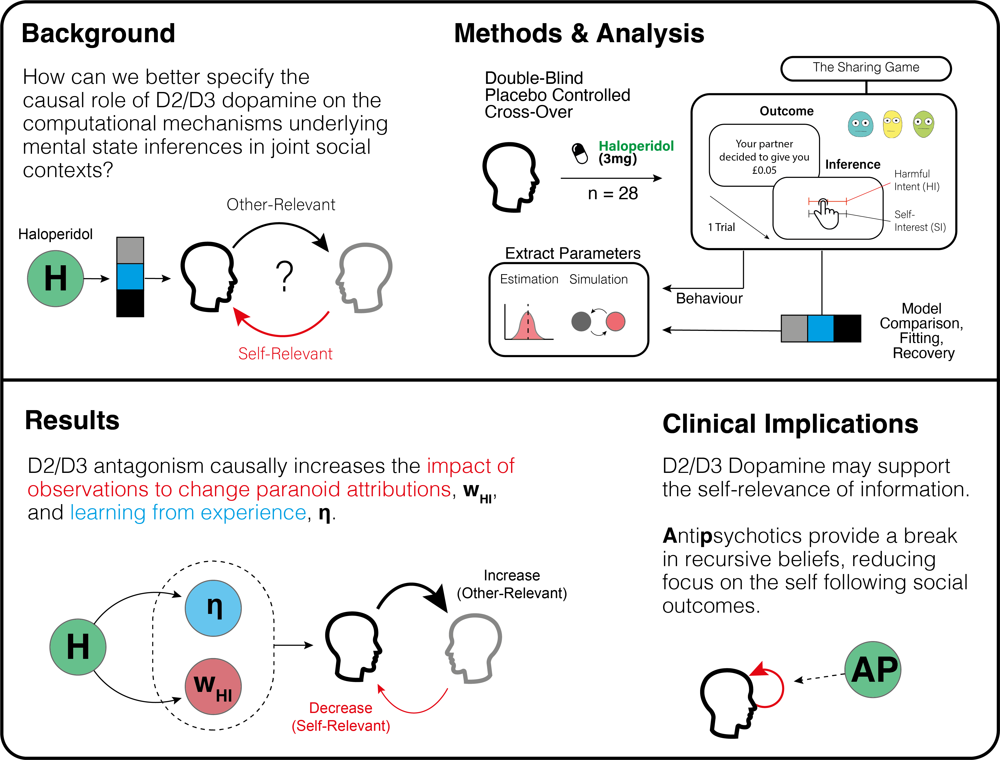

# Barnby etal 2023 D2D3 Modelling

    
        
    
             
         

Repository for this paper: 

Below is the graphical summary and data guide to navigate the repo.

## Graphical Abstract

## Model 

You can play around with and simulate outcomes from the model included in this paper [here](https://soccrlab.shinyapps.io/MentalStateInferenceModel/)

## Data

- data for Matlab fitting ([DRUG].csv), where DRUG = {HALO, LDOPA, PLAC}
- data to list order of responses from partially fair Dictator's (RandomisedSchedule.csv)
- data for participant responses (TaskData.csv)
- folder of simulated outcomes from model simulations (/SimulatedData/...)

## R

- Analysis script (ModellingAnalysis_GitHub.R)

## Matlab

- fitted real (/HBIFit/...) and simulated parameters (/HBIFit_Sim/...) following HBI processing
- individual subject level model fits for real (/Lap_Subj/...) and simulated (/Lap_Subj_Sim/...) parameters
- laplace fitted models parameters for real (/LaplaceFit/...) and simulated (/LaplaceFit_Sim/...) data
- Model files (/MatlabModels/...)
- Fitting scripts for real (/MasterFileMOBS1/...) and simulated (/MasterFileRECOVERYMOBS1/...) data
